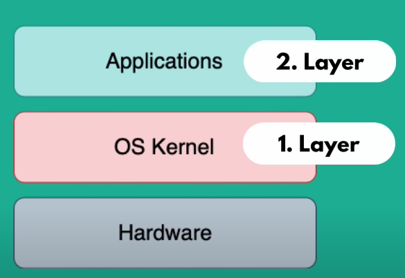

# Docker Tutorial

Following this tutorial video [Docker Tutorial for Beginners](https://www.youtube.com/watch?v=3c-iBn73dDE)

## Table of Contents

 1. What is Docker? What is a Container?

 2. Docker vs Virtual Machine

 3. Docker Installation (Not covered in the notes)

 4. Main Commands

 5. Debugging a Container

 6. Demo Project

    1. Developing with Containers

    2. Docker Compose - Running Multiple Servers

    3. Dockerfile - Building own Docker Image

    4. Private Docker Repository (AWS)

    5. Deploying the containerized App

 7. Volume - Persisting Data

 ## What is Docker, What is a Container?

 Container 
 
  - A way to package application with all the necessary dependencies and configurations

 - Portable artifact, easily shared and moved around

 - Makes development and deployment more efficient

Where do containers live?

 - They are stored in container repositories

 - Companies can use private repositories to store containers

 - Public repository for docker is [**DockerHub**](https://hub.docker.com/)
 
    - Public repositories have public images from official comapnies like Jenkins, MySQL, ...

How does docker improve the development process?

 - When developing in a team without docker

    - Everyone in the team needs to install the same applications on multiple OS depending on devices. Many steps for installation where something could go wrong.

 - With containers

    - A container has its own isolated environment with linux based image. It is packaged with all needed configurations, just have to look up the container from the repository.

    - Only require one command to install the application, makes it much easier to set up local environment. Multiple versions on same application can run without conflict

How does docker improve the deployment process?

 - Without docker

    - Deployment team will provide artifacts and instructions on how to install artifacts on server. May come with some other service like database for installation on server.

    - Operations team will handle the setting up and configuration on the server

    - Errors can arise from dependency version conflicts, or misunderstanding between development and operations team

 - With docker

    - Developers and operations work together to package the application in a container

    - No environment configuration needed on server, except docker runtime

    - Just have to pull container into server and run container

What is a container?

 - A container contains layers of image with **Linux Base Image** as it is small in size

 - On top of the base image, there is application image like **postgres**, also have intermediate layers

 - To pull and run container from public repository, search the repository name and get the version wanted (not necessary for latest version) and use the command `docker run postgres:9.6` on a CLI

 - If a newer version of a container is installed, only need to download the layers that changed from the version available on local machine

 - `docker ps` shows the containers currently running

 - Image is the actual package with the configuration and application. it is an artifact that can be moved around

 - Container is what start and run the application inside the container environment

## Docker vs Virtual Machine

Operating system has two layers, the first layer **OS Kernel** that communicates with hardware, and the **Applications** that run on the kernel layer

Both Docker and Virtual Machines are virtualisation tools

 - Docker virtualises the Applications layer and uses the Kernel of its host

 - Virtual machines virtualises both the Application layer and the Kernel layer

These differences makes docker containers much smaller and faster than virtual machines. But there might be issues with running some images depending on the kernel (mismatch of kernels). There is a workaround using **Docker Toolbox**. Docker runs natively on Windows 10

