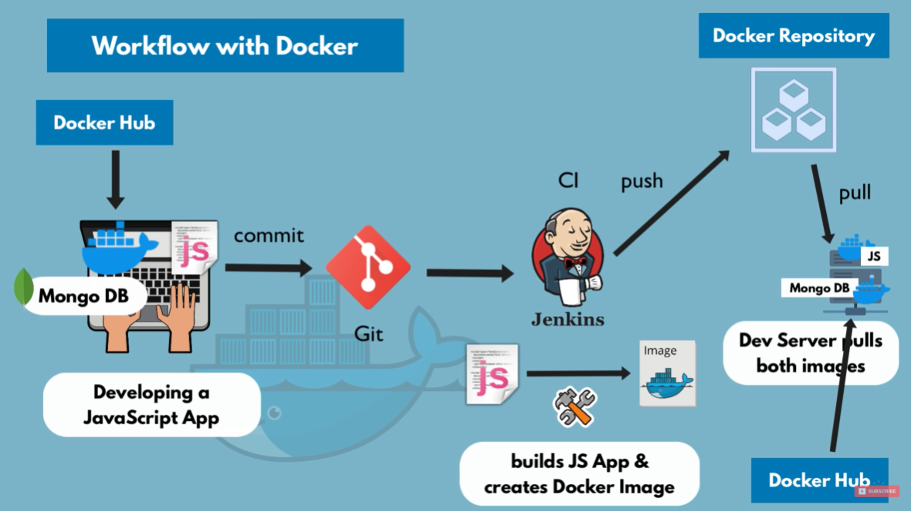
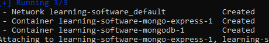
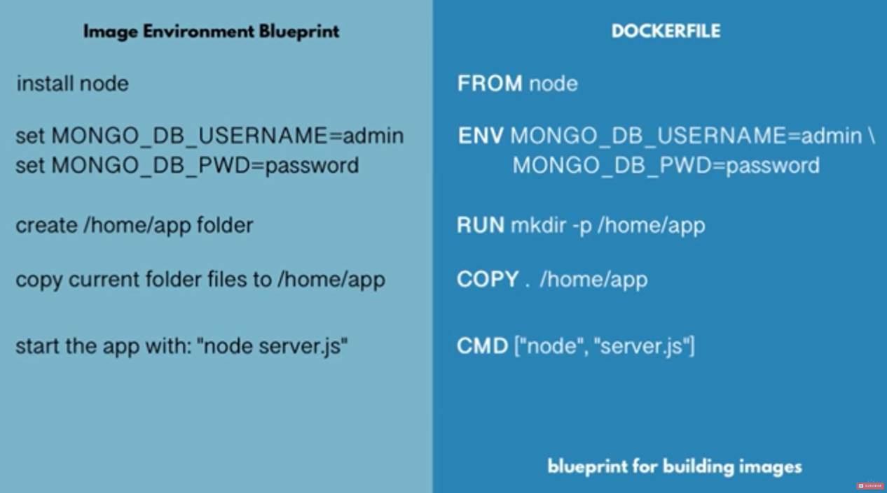

# Docker Tutorial

Following this tutorial video [Docker Tutorial for Beginners](https://www.youtube.com/watch?v=3c-iBn73dDE)

## Table of Contents

 1. What is Docker? What is a Container?

 2. Docker vs Virtual Machine

 3. Docker Installation (Not covered in the notes)

 4. Main Commands

 5. Debugging a Container

 6. Demo Project

    1. Developing with Containers

    2. Docker Compose - Running Multiple Servers

    3. Dockerfile - Building own Docker Image

    4. Private Docker Repository (AWS)

    5. Deploying the containerized App

 7. Volume - Persisting Data

 ## What is Docker, What is a Container?

 Container 
 
  - A way to package application with all the necessary dependencies and configurations

 - Portable artifact, easily shared and moved around

 - Makes development and deployment more efficient

Where do containers live?

 - They are stored in container repositories

 - Companies can use private repositories to store containers

 - Public repository for docker is [**DockerHub**](https://hub.docker.com/)
 
    - Public repositories have public images from official comapnies like Jenkins, MySQL, ...

How does docker improve the development process?

 - When developing in a team without docker

    - Everyone in the team needs to install the same applications on multiple OS depending on devices. Many steps for installation where something could go wrong.

 - With containers

    - A container has its own isolated environment with linux based image. It is packaged with all needed configurations, just have to look up the container from the repository.

    - Only require one command to install the application, makes it much easier to set up local environment. Multiple versions on same application can run without conflict

How does docker improve the deployment process?

 - Without docker

    - Deployment team will provide artifacts and instructions on how to install artifacts on server. May come with some other service like database for installation on server.

    - Operations team will handle the setting up and configuration on the server

    - Errors can arise from dependency version conflicts, or misunderstanding between development and operations team

 - With docker

    - Developers and operations work together to package the application in a container

    - No environment configuration needed on server, except docker runtime

    - Just have to pull container into server and run container

What is a container?

 - A container contains layers of image with **Linux Base Image** as it is small in size

 - On top of the base image, there is application image like **postgres**, also have intermediate layers

 - To pull and run container from public repository, search the repository name and get the version wanted (not necessary for latest version) and use the command `docker run postgres:9.6` on a CLI

 - If a newer version of a container is installed, only need to download the layers that changed from the version available on local machine

 - `docker ps` shows the containers currently running

 - Image is the actual package with the configuration and application. it is an artifact that can be moved around

 - Container is what start and run the application inside the container environment

## Docker vs Virtual Machine

Operating system has two layers, the first layer **OS Kernel** that communicates with hardware, and the **Applications** that run on the kernel layer


Both Docker and Virtual Machines are virtualisation tools

 - Docker virtualises the Applications layer and uses the Kernel of its host

 - Virtual machines virtualises both the Application layer and the Kernel layer

These differences makes docker containers much smaller and faster than virtual machines. But there might be issues with running some images depending on the kernel (mismatch of kernels). There is a workaround using **Docker Toolbox**. Docker runs natively on Windows 10

## Basic Commands

```sh
# show running container and images
docker ps

# show all running and stopped containers and images
docker ps -a

# show available images on local repo
docker images

# pull image from repository
docker pull <imageName>

# run image, if not found locally will search dockerhub. Can specify version number at end
docker run <imageName>

# run image in a detached mode
docker run -d <imageName>

# running image and binding host-port:container-port, host-port must be unique but container port not
docker run -p6000:6379 <imageName>

# running and creating container with name, can rename existing containers
docker run -d -p6001:6379 --name <containerName> <imageName>

# running application within network with environmental variables
docker run -d -p27017:27017 -e MONGO_INITDB_ROOT_PASSWORD=password -e MONGO_INITDB_ROOT_USERNAME=admin --name mongodb --net mongo-network mongo
docker run -d -p8081:8081 -e ME_CONFIG_MONGODB_AUTH_USERNAME=admin -e ME_CONFIG_MONGODB_AUTH_PASSWORD=password --network mongo-network --name mongo-express -e ME_CONFIG_MONGODB_SERVER=mongodb mongo-express

# running container that has previously created by docker run
docker start <containerID>

# removing container
docker rm <containerId>

# removing images
docker rmi <imageId>

# stop image and container running on terminal
Ctrl+c

# stop container using id
docker stop <containerID>

# view container logs
docker logs <containerID>
docker logs <containerName>

# open terminal of running container, it stands for interactive terminal
docker exec -it <containerID>

# display networks in docker
docker network ls

# creating network for containers to run in
docker network create <name>

# docker compose command for starting
docker-compose -f mongo.yaml up

# docker compose command for stopping, also deletes network
docker-compose -f mongo.yaml down

# building docker app, the first parameter is tag, the other is the dockerfile location
docker build -t my-app:1.0 .
```

## Docker Demo Project

Scenario: Developing JS application on laptop

 - Developing app with MongoDB on docker

 - Commit application to Git, that Jenkis uses for CI/DI and produces Docker Image and pushed to private docker repository.

 - The server pulls the application image from the private repository, and also pulls MongoDB from docker hub.



 - Within an Isolated Docker Network, containers can communicate with each other just by using their container names.

 - Check through the readme for configurations when connecting multiple containers, like mongo and mongo-express

## Docker Compose

Using a configuration file to configure multiple `docker run` commands to make it easier to start multiple containers and images at once

It is a structured way to contain docker commands, with easy editing

Network is not required to be specified as Docker Compose will create a common network for all containers using the container names

```sh
version: '3'
services:
  mongodb:
    image: mongo
    ports:
      - 27017:27017
    environment:
      - MONGO_INITDB_ROOT_USERNAME=admin
      - MONGO_INITDB_ROOT_PASSWORD=password
  mongo-express:
    image: mongo-express
    ports:
      - 8080:8081
    environment:
      - ME_CONFIG_MONGODB_AUTH_USERNAME=admin
      - ME_CONFIG_MONGODB_AUTH_PASSWORD=password
      - ME_CONFIG_MONGODB_SERVER=mongodb
    restart: on-failure
```

The network and container names can be found at the start of the logs after running `docker-compose`



The logs of the different containers may be mixed as they could be waiting on each other

There is no data persistance in containers by default, need to use volumes to persist data after each restart

## Building Docker Image for JS Application

To do so, need to package the application into a docker image

Jenkins is the application that can help with building the docker image

 - it packages the javascript file into docker image

 - and puts it into a docker repository

A dockerfile is a blueprint for creating docker images

The image to be built will be built based off another image, in this case node

Environmental variables can be set within the docker image, but better to place outside in docker-compose as it would be easier to ammend and configure for changes

All the `RUN` commands are based on linux commands

`COPY` command copies executes on the host machine, to copy files into the image

Difference between `RUN` and `CMD` is that can have multiple `RUN` commands but `CMD` is the entrypoint command

```
FROM node

ENV MONGO_DB_USERNAME=admin \ MONGO_DB_PWD=password

RUN mkdir -p /home/app

COPY . /home/app

CMD ["node", "home/app/server.js"]
```



Dockerfile must be called 'Dockerfile'

Whenever dockerfile changes, need to rebuild it again

